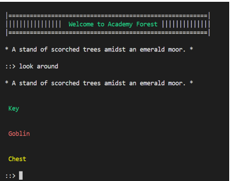

# academy-forest
# Description 
Playing around with some command line based OOP in a classic text adventure style

## Design Discussion
https://medium.com/@thomas.r.estabrook/academy-forest-playing-with-object-oriented-programming-in-python-30198b2df400

## Pull Request tasks
The following ideas if you would like to do a pull request against this project:

- [ ] jakte insekter! ALL DEFECT corrections
- [ ] external data format for Spaces, Items, Area
- [ ] Environment building module
- [ ] Item building module
- [ ] Enemuration or similar for "use" attributes
- [ ] Stats feature
- [ ] Skill feature

Rules of thumb to keep in mind from https://developers.google.com/blockly/guides/contribute/get-started/write_a_good_pr

- Fix one problem. Don't try to tackle multiple issues at once.
- Limit the scope. Usually a PR should take < 8hrs (depending on your familiarity with the codebase).
- Use commits. If your PR feels a little big, split the changes into logical groups using git commits.

## Prerequisite:
   Python 3.10 - needed because of the use of match-case statements
 
## Run:
  python3.10 academy-forest.py
