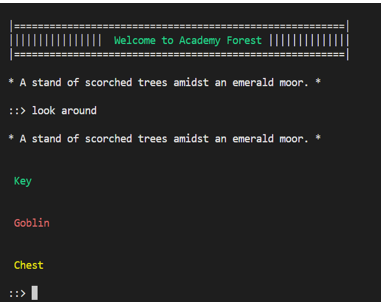

# Academy Forest

A text-based adventure game built in Python, inspired by classic MUD/interactive fiction games. Navigate a procedurally-connected forest, collect items, unlock chests, battle monsters, and complete a quest.



## Gameplay

- **Explore** a 5x5 grid-based world with 9 interconnected forest locations
- **Collect** items: keys, swords, scrolls, and more
- **Unlock** containers with found keys to access hidden items
- **Battle** monsters in turn-based combat with damage multipliers
- **Win** by finding the scroll and placing it on the pedestal

### Commands

| Command | Example | Description |
|---------|---------|-------------|
| `move <direction>` | `move north` | Navigate between connected spaces |
| `look <target>` | `look east` | Inspect surroundings or a direction |
| `take <item>` | `take key` | Pick up an item from the current space |
| `use <item>` | `use sword` | Use an item (unlock, attack, finish quest) |
| `help` | `help` | Show available commands |
| `quit` | `quit` | Exit the game |

## Architecture

```
Finish         — Win condition handler (quest completion)
Space          — World locations with connections, items, monsters
Area           — 2D grid manager connecting Spaces
Item           — Collectible objects with use actions
Inventory      — Container for Items (player bags, locked chests)
Monster        — Adversaries with HP, damage, and state
Player         — Player state: HP, inventory, location, actions
Battle         — Turn-based combat engagement manager
```

## Design

Read the design writeup: [Academy Forest — OOP in Python](https://medium.com/@thomas.r.estabrook/academy-forest-playing-with-object-oriented-programming-in-python-30198b2df400)

## Prerequisites

Python 3.10+ (uses `match-case` statements)

## Run

```bash
python academy-forest-game.py
```

## License

[MIT](LICENSE)
